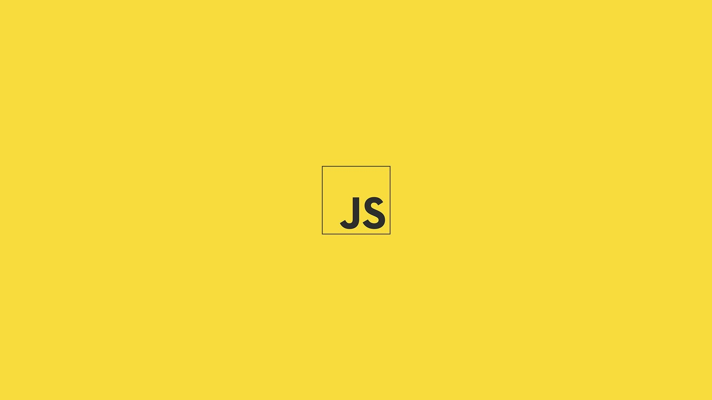

<h1 align="center"> Projeto-Script </h1>

Testando JavaScript: Botão interativo / Night Mode & Lightning Mode.

  <a href="#-tecnologias">Tecnologias</a>&nbsp;&nbsp;&nbsp;|&nbsp;&nbsp;&nbsp;
  <a href="#-projeto">Projeto</a>&nbsp;&nbsp;&nbsp;|&nbsp;&nbsp;&nbsp;
  <a href="#-layout">Layout</a>&nbsp;&nbsp;&nbsp;|&nbsp;&nbsp;&nbsp;
  <a href="#memo-licença">Licença</a>

  

 

  

## 🚀 Tecnologias

Esse projeto foi desenvolvido com as seguintes tecnologias:

- HTML e CSS
- JavaScript
- Git e Github

## 💻 Projeto

Este projeto mostra botão interativo feito via JavaScript: Obtendo o layout da página no modo claro e escuro, contendo mudança de imagem/profile.

## 🔖 Layout

Você pode visualizar o layout do projeto através [DESSE LINK](https://youtu.be/wRci_R6zMjQ). Irei sempre que possivel postar alguns projetos lá! Se puder inscreva-se!

Necessário ter conta no [YOUTUBE](https://www.youtube.com/) para se inscrever!.

## :memo: Licença

Esse projeto está sob a licença MIT.

---

Feito com ♥ por Pedro Igor Campos Costa - 2ª Semestre - Ciência da computação! :wave:
